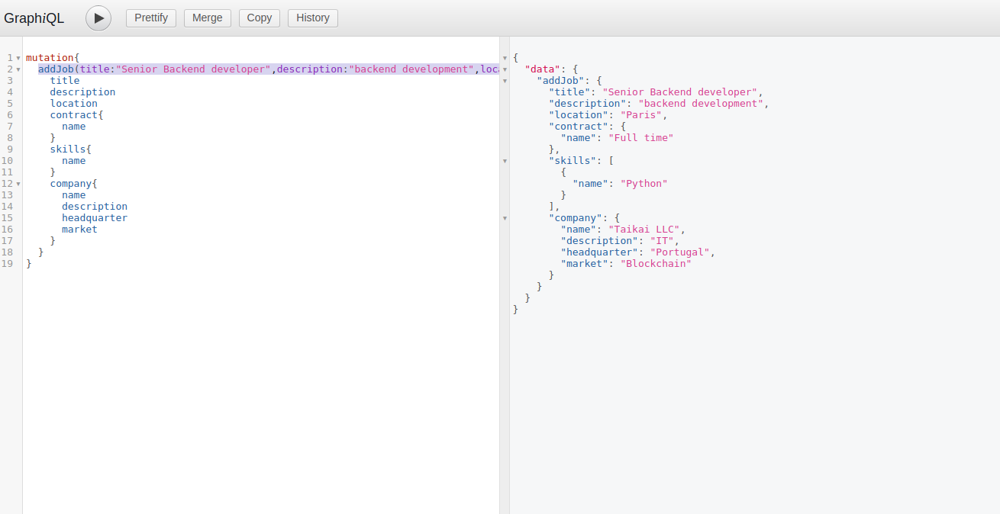
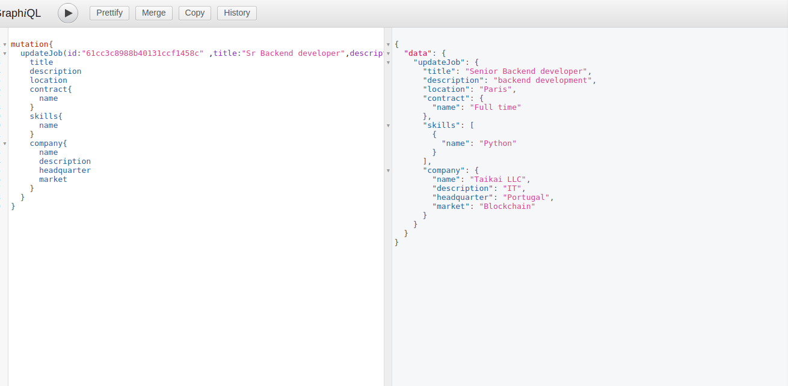
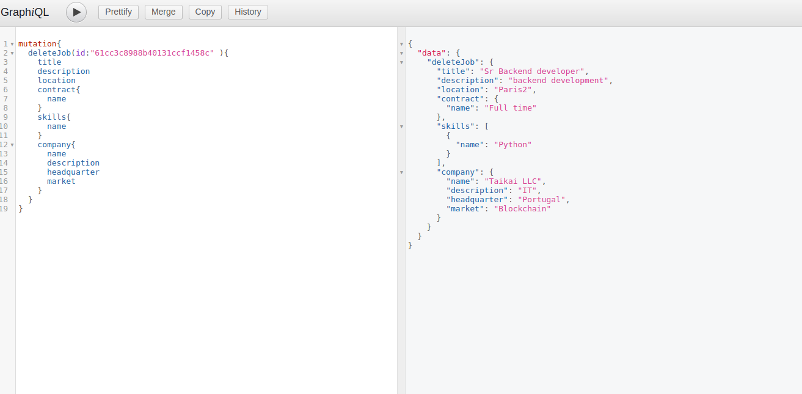
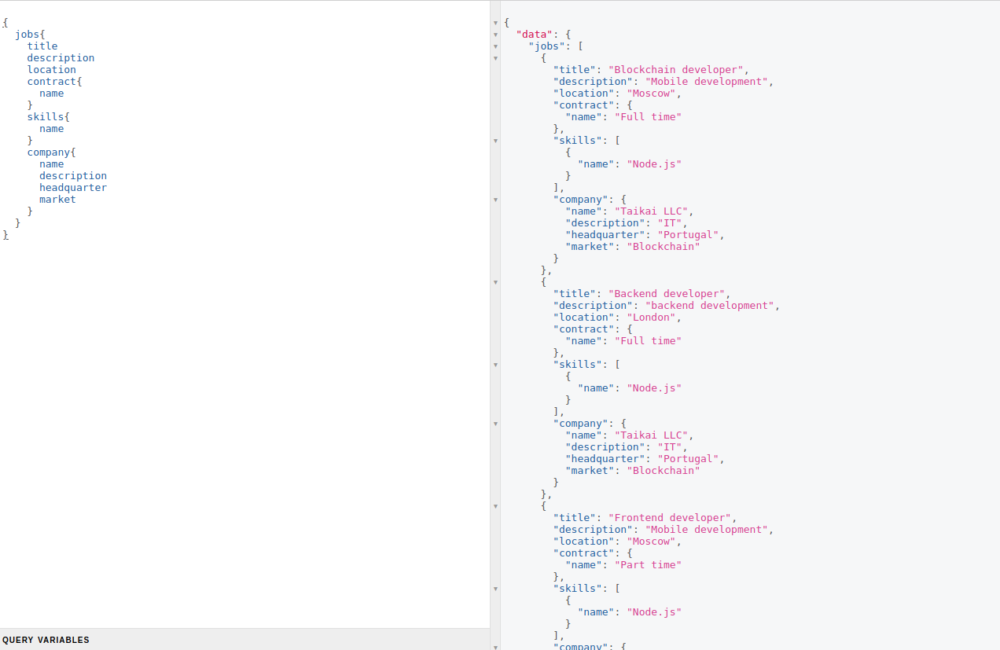

# jobfair
job board api using graphQL

1. clone the repo
 ```
git clone https://github.com/bm777/jobfair.git

 ```
2. install node packages
```
npm i express nodemon express-graphql grphql mongoose
```
3. run the api server
```
nodemon server.js
```

# Endpoints: graphql queries

- create job: addJob
```
mutation{
  addJob(title:"Senior Backend developer",description:"backend development",location:"Paris", contractId:"61c54a185e22f1def6ebbe61",skillId:"61c54a585e22f1def6ebbe67",companyId:"61c54acc5e22f1def6ebbe6f"){
    title
    description
    location
    contract{
      name
    }
    skills{
      name
    }
    company{
      name
      description
      headquarter
      market
    }
  }
}
```



- update job: updateJob
```
mutation{
  updateJob(id:"61cc3c8988b40131ccf1458c" ,title:"Sr Backend developer",description:"backend development",location:"Paris2", contractId:"61c54a185e22f1def6ebbe61",skillId:"61c54a585e22f1def6ebbe67",companyId:"61c54acc5e22f1def6ebbe6f"){
    title
    description
    location
    contract{
      name
    }
    skills{
      name
    }
    company{
      name
      description
      headquarter
      market
    }
  }
}
```


- delete job: deleteJob
```
mutation{
  deleteJob(id:"61cc3c8988b40131ccf1458c" ){
    title
    description
    location
    contract{
      name
    }
    skills{
      name
    }
    company{
      name
      description
      headquarter
      market
    }
  }
}
```


- list job: jobs
```
{
  jobs{
    title
    description
    location
    contract{
      name
    }
    skills{
      name
    }
    company{
      name
      description
      headquarter
      market
    }
  }
}
```
